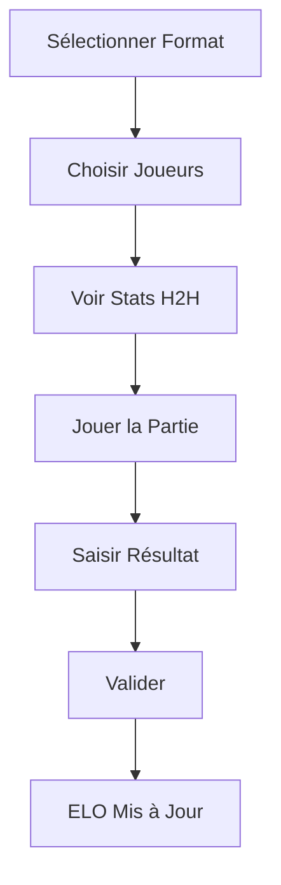

# 🎱 Billiard Tracker - Système de suivi ELO pour billard


Progressive Web App (PWA) pour gérer et suivre les parties de billard avec un système de classement ELO sophistiqué. Optimisée pour Raspberry Pi et utilisable offline.

## 📋 Description

Billiard Tracker est une application web full-stack conçue pour gérer les parties de billard dans un environnement de bureau. Elle fonctionne sur un Raspberry Pi Zero 2 W et offre :

- 🏆 Système ELO avancé avec anti-farming et inflation
- 👥 Gestion multi-formats (1v1, 2v2, 3v3, 1v2, 2v3)
- 📱 Interface PWA mobile-first installable
- 🔌 Mode offline avec synchronisation automatique
- 📊 Statistiques détaillées et head-to-head
- ⚙️ Panel d'administration complet
- 💾 Export de données en JSON

## ✨ Fonctionnalités

### Formats de Jeu
| Format | Description | ELO Classé |
|--------|-------------|-----------|
| **1v1** | Duel individuel | ✅ Oui |
| **2v2** | Équipes de 2 (persistantes) | ✅ Oui |
| **3v3** | Équipes de 3 | ❌ Stats uniquement |
| **1v2** | 1 joueur vs 2 joueurs | ❌ Stats uniquement |
| **2v3** | 2 joueurs vs 3 joueurs | ❌ Stats uniquement |

### Système ELO

#### Formule de Calcul
```
ΔElo = K_eff × f_mov × f_inflation × (Score - Expected) + win_bonus
```

**Composantes :**
- **K_eff** : K de base modulé par anti-farm (défaut: 24)
- **f_mov** : Facteur de marge de victoire (α = 0.5)
- **f_inflation** : Points ajoutés à chaque match (+2 par défaut)
- **win_bonus** : Bonus minimum du vainqueur (+1 par défaut)
- **Expected** : Probabilité de victoire ELO standard

#### Mécanismes Avancés

**🛡️ Anti-Farm**
- Réduit le gain pour le favori battant un adversaire faible
- Formule : `K_eff = K_base × (1 - β × min(rating_diff / δ, 1))`
- Paramètres : β = 0.5, δ = 400

**📈 Inflation ELO**
- Évite la stagnation des ratings
- Les deux joueurs/équipes gagnent des points à chaque match
- Défaut : +2 points pour chaque participant

**🎯 Margin of Victory**
- Récompense les victoires dominantes
- Basé sur le nombre de boules restantes (0-7)
- Formule : `f_mov = 1 + α × (balls_remaining / 7)`

### Pages de l'Application

1. **🎮 Jouer**
   - Sélection du format de jeu
   - Grille de sélection des joueurs (tactile)
   - Affichage automatique des stats H2H
   - Saisie du résultat (vainqueur, boules, fautes)

2. **🏆 Classement**
   - Leaderboard 1v1 (joueurs individuels)
   - Leaderboard 2v2 (équipes)
   - Classement global (agrégé pondéré)
   - Médailles pour le top 3
   - Badges de streaks (≥5 victoires/défaites)

3. **📊 Historique**
   - Liste des 20 derniers matchs
   - Filtrage par format/joueur (à venir)
   - Suppression de match (admin)

4. **👥 Joueurs**
   - Liste complète des joueurs
   - Profils détaillés (stats, équipes, matchs récents)
   - Ajout de nouveaux joueurs
   - Suppression (admin)

5. **⚙️ Administration**
   - Connexion par PIN (défini au premier accès)
   - Configuration des paramètres ELO
   - Recalcul global des ratings
   - Export des données JSON
   - Gestion des joueurs/matchs

## 🔧 Prérequis

### Matériel
- **Raspberry Pi Zero 2 W** (ou modèle supérieur)
- Carte micro-SD 16 Go minimum (Class 10 / A1)
- Alimentation 5V 2.5A
- Connexion Wi-Fi

### Logiciel
- Raspberry Pi OS Lite (64-bit)
- Python 3.9+
- Nginx
- Avahi (mDNS)

## 📦 Installation

### Installation Automatique (Recommandée)

```bash
# Se connecter au Raspberry Pi via SSH
ssh pi@raspberrypi.local

# Télécharger et exécuter le script d'installation
wget https://raw.githubusercontent.com/[votre-repo]/billiard-tracker/main/scripts/install.sh
chmod +x install.sh
./install.sh

# L'application sera accessible à : http://billiard.local
```

Le script d'installation configure automatiquement :
- ✅ Paquets système (Python, Nginx, Avahi)
- ✅ Environnement Python virtuel
- ✅ Service systemd
- ✅ Reverse proxy Nginx
- ✅ Service discovery mDNS
- ✅ Sauvegarde quotidienne automatique

### Installation Manuelle

<details>
<summary>Cliquer pour voir les étapes détaillées</summary>

```bash
# 1. Mise à jour système
sudo apt update && sudo apt upgrade -y

# 2. Installation des dépendances
sudo apt install -y python3 python3-pip python3-venv git nginx avahi-daemon sqlite3

# 3. Cloner le projet
cd /home/pi
git clone https://github.com/[votre-repo]/billiard-tracker.git
cd billiard-tracker

# 4. Créer l'environnement virtuel Python
python3 -m venv venv
source venv/bin/activate

# 5. Installer les dépendances Python
pip install -r backend/requirements.txt

# 6. Créer le service systemd
sudo tee /etc/systemd/system/billiard-tracker.service > /dev/null <<EOF
[Unit]
Description=Billiard Tracker API
After=network.target

[Service]
Type=simple
User=pi
WorkingDirectory=/home/pi/billiard-tracker
Environment="PATH=/home/pi/billiard-tracker/venv/bin"
ExecStart=/home/pi/billiard-tracker/venv/bin/uvicorn backend.app.main:app --host 0.0.0.0 --port 8000
Restart=always
RestartSec=10

[Install]
WantedBy=multi-user.target
EOF

# 7. Configurer Nginx
sudo tee /etc/nginx/sites-available/billiard-tracker > /dev/null <<EOF
server {
    listen 80;
    server_name billiard.local;

    location / {
        root /home/pi/billiard-tracker/frontend;
        index index.html;
        try_files \$uri \$uri/ /index.html;
    }

    location /api/ {
        proxy_pass http://127.0.0.1:8000/;
        proxy_set_header Host \$host;
        proxy_set_header X-Real-IP \$remote_addr;
    }

    location ~ ^/(manifest.json|service-worker.js)$ {
        root /home/pi/billiard-tracker/frontend;
        add_header Cache-Control "no-cache, no-store, must-revalidate";
    }
}
EOF

sudo ln -s /etc/nginx/sites-available/billiard-tracker /etc/nginx/sites-enabled/
sudo rm -f /etc/nginx/sites-enabled/default
sudo nginx -t

# 8. Configurer Avahi (mDNS)
sudo tee /etc/avahi/services/billiard.service > /dev/null <<EOF
<?xml version="1.0" standalone='no'?>
<!DOCTYPE service-group SYSTEM "avahi-service.dtd">
<service-group>
  <name>Billiard Tracker</name>
  <service>
    <type>_http._tcp</type>
    <port>80</port>
  </service>
</service-group>
EOF

# 9. Démarrer les services
sudo systemctl daemon-reload
sudo systemctl enable billiard-tracker nginx avahi-daemon
sudo systemctl start billiard-tracker nginx avahi-daemon

# 10. Vérifier le statut
sudo systemctl status billiard-tracker
```

</details>

## 🚀 Utilisation

### Accès à l'Application

**Sur le réseau local :**
- http://billiard.local (recommandé)
- http://[IP-du-raspberry]

**Installation PWA sur smartphone :**
1. Ouvrir l'URL dans Chrome/Safari
2. Menu → "Ajouter à l'écran d'accueil"
3. L'icône apparaît sur l'écran d'accueil
4. Ouverture en mode plein écran

### Workflow d'une Partie



1. **Sélection du format** : 1v1, 2v2, etc.
2. **Sélection des joueurs** :
   - Tap sur les tuiles pour sélectionner
   - Bleu = Équipe A, Jaune = Équipe B
   - Tap à nouveau pour désélectionner
3. **Stats H2H** : Affichage automatique quand les équipes sont complètes
4. **Saisie du résultat** :
   - Sélectionner le vainqueur (A ou B)
   - Ajuster les boules restantes (0-7)
   - Cocher "Faute sur la noire" si applicable
   - Cocher/décocher "Partie classée" (affecte l'ELO)
5. **Validation** : Enregistrement et mise à jour instantanée

### Administration

**Premier Accès :**
1. Aller dans l'onglet Admin
2. Entrer un PIN de votre choix
3. Ce PIN sera stocké (hashé) et requis pour les accès suivants

**Fonctionnalités Admin :**
- 📝 Modifier les paramètres ELO (K, α, β, δ, inflation)
- 🔄 Recalculer tous les ELO depuis l'historique
- 💾 Exporter toutes les données en JSON
- 🗑️ Supprimer des matchs (recalcul auto des ELO)
- 👤 Supprimer des joueurs (supprime leurs matchs)

## 💾 Sauvegarde et Restauration

### Sauvegardes Automatiques

Le script d'installation configure une sauvegarde quotidienne :
- **Fréquence** : Chaque jour à 2h00
- **Rétention** : 30 jours
- **Emplacement** : `/home/pi/billiard-tracker/data/backups/`
- **Format** : `billiard-YYYY-MM-DD.db`

### Sauvegarde Manuelle

```bash
# Créer une sauvegarde immédiate
cd /home/pi/billiard-tracker
mkdir -p data/backups
cp data/billiard.db "data/backups/billiard-$(date +%Y-%m-%d-%H%M%S).db"
```

### Restauration

```bash
# 1. Arrêter le service
sudo systemctl stop billiard-tracker

# 2. Restaurer la sauvegarde
cp data/backups/billiard-2025-11-19.db data/billiard.db

# 3. Redémarrer le service
sudo systemctl start billiard-tracker
```

### Export JSON

Via l'interface admin (bouton "Exporter les données") :
- Export complet de la base de données
- Format JSON structuré
- Inclut joueurs, matchs, équipes, ratings, paramètres
- Téléchargement automatique du fichier

## 🐛 Dépannage

### Vérifier les Services

```bash
# Status de l'API
sudo systemctl status billiard-tracker

# Status de Nginx
sudo systemctl status nginx

# Logs en temps réel
sudo journalctl -u billiard-tracker -f

# Logs des 50 dernières lignes
sudo journalctl -u billiard-tracker -n 50
```

### Problèmes Courants

**❌ L'application n'est pas accessible**
```bash
# Vérifier la connexion
ping billiard.local

# Vérifier les services
sudo systemctl status billiard-tracker nginx

# Redémarrer si nécessaire
sudo systemctl restart billiard-tracker nginx
```

**❌ Erreur 502 Bad Gateway**
```bash
# L'API n'est pas démarrée
sudo systemctl restart billiard-tracker

# Vérifier les logs
sudo journalctl -u billiard-tracker -n 50
```

**❌ Base de données verrouillée**
```bash
# Vérifier les processus utilisant la DB
sudo lsof /home/pi/billiard-tracker/data/billiard.db

# Redémarrer l'API
sudo systemctl restart billiard-tracker
```

**❌ Le mDNS ne fonctionne pas**
```bash
# Redémarrer Avahi
sudo systemctl restart avahi-daemon

# Utiliser l'IP directement
hostname -I
```

**❌ Espace disque plein**
```bash
# Vérifier l'espace disponible
df -h

# Nettoyer les anciennes sauvegardes
cd /home/pi/billiard-tracker/data/backups
ls -lth | tail -n +31 | awk '{print $9}' | xargs rm -f
```

## 🔄 Mises à Jour

```bash
# 1. Se connecter au Pi
ssh pi@raspberrypi.local

# 2. Naviguer vers le projet
cd /home/pi/billiard-tracker

# 3. Sauvegarder la base de données
cp data/billiard.db data/billiard.db.backup

# 4. Récupérer les mises à jour
git pull origin main

# 5. Mettre à jour les dépendances Python
source venv/bin/activate
pip install -r backend/requirements.txt --upgrade

# 6. Redémarrer les services
sudo systemctl restart billiard-tracker
sudo systemctl restart nginx

# 7. Vérifier que tout fonctionne
sudo systemctl status billiard-tracker
```

## 📈 Performance et Limites

### Performances Testées

| Métrique | Valeur Testée | Statut |
|----------|---------------|--------|
| Matchs par jour | ~100 | ✅ Excellent |
| Joueurs simultanés | ~20 | ✅ Bon |
| Taille de la DB | 1 Go | ✅ Performant |
| Temps de réponse API | <100ms | ✅ Rapide |
| Temps de rebuild ELO | <5s (1000 matchs) | ✅ Acceptable |

### Optimisations Implémentées

- ✅ Index SQLite sur colonnes fréquemment requêtées
- ✅ Cache Nginx pour ressources statiques
- ✅ Pagination sur les endpoints d'historique
- ✅ Service Worker avec cache stratégique
- ✅ Compression gzip activée

### Limites Connues

- 🔶 SQLite peut avoir des problèmes de concurrence avec >50 utilisateurs simultanés
- 🔶 Pas de système de migration de schéma (Alembic non configuré)
- 🔶 Recherche dans l'historique non implémentée (prévue v1.1)

## 🛡️ Sécurité

### Recommandations pour Production

**⚠️ Important :** Cette application est conçue pour un réseau local de confiance. Pour une utilisation sur internet :

1. **HTTPS** : Configurer un certificat SSL
   ```bash
   sudo apt install certbot python3-certbot-nginx
   sudo certbot --nginx -d votre-domaine.com
   ```

2. **CORS** : Restreindre les origines dans `backend/app/main.py`
   ```python
   allow_origins=["http://billiard.local", "https://votre-domaine.com"]
   ```

3. **Firewall** : Limiter l'accès aux ports nécessaires
   ```bash
   sudo ufw allow 22/tcp   # SSH
   sudo ufw allow 80/tcp   # HTTP
   sudo ufw allow 443/tcp  # HTTPS (si configuré)
   sudo ufw enable
   ```

4. **PIN Admin** : Choisir un PIN robuste (6+ chiffres)

### Sécurité Actuelle

- ✅ Sessions admin avec expiration (30 minutes)
- ✅ PIN hashé en base de données (SHA-256)
- ⚠️ Tokens passés en query string (à améliorer)
- ⚠️ CORS ouvert (acceptable sur LAN privé)

## 📚 Documentation Technique

### Architecture

```
┌─────────────┐
│  Smartphone │
│   (PWA)     │
└──────┬──────┘
       │ HTTP
       ↓
┌─────────────┐
│    Nginx    │ ← Reverse Proxy
└──────┬──────┘
       │
       ↓
┌─────────────┐
│  FastAPI    │ ← Backend API
│  (Uvicorn)  │
└──────┬──────┘
       │
       ↓
┌─────────────┐
│   SQLite    │ ← Database
└─────────────┘
```

### API Endpoints

| Méthode | Endpoint | Description | Auth |
|---------|----------|-------------|------|
| GET | `/` | Info API | ❌ |
| GET | `/players` | Liste joueurs | ❌ |
| POST | `/players` | Créer joueur | ❌ |
| GET | `/players/{id}` | Détails joueur | ❌ |
| GET | `/players/{id}/summary` | Profil complet | ❌ |
| POST | `/matches` | Créer match | ❌ |
| GET | `/history` | Historique matchs | ❌ |
| GET | `/leaderboard/{format}` | Classement | ❌ |
| POST | `/head-to-head` | Stats H2H | ❌ |
| POST | `/admin/login` | Connexion admin | ❌ |
| GET | `/admin/settings` | Récupérer paramètres | ✅ |
| POST | `/admin/settings` | Modifier paramètres | ✅ |
| GET | `/admin/export` | Exporter données | ✅ |
| POST | `/admin/rebuild-ratings` | Recalculer ELO | ✅ |
| DELETE | `/admin/matches/{id}` | Supprimer match | ✅ |
| DELETE | `/admin/players/{id}` | Supprimer joueur | ✅ |

### Schéma de Base de Données

<details>
<summary>Voir le schéma complet</summary>

**Players** (Joueurs)
- id (PK)
- name (Unique)
- is_guest (Boolean)
- created_at (DateTime)

**Teams** (Équipes 2v2)
- id (PK)
- key (Unique, format: "12-34")
- name (Auto-généré: "Player1 + Player2")
- created_at (DateTime)

**TeamMembers** (Membres d'équipes)
- team_id (PK, FK)
- player_id (PK, FK)

**Matches** (Matchs)
- id (PK)
- format ('1v1', '2v2', '3v3', '1v2', '2v3')
- played_at (DateTime, indexed)
- balls_remaining (0-7)
- winner_side ('A' or 'B')
- foul_black (Boolean)
- ranked (Boolean)
- team_id_a (FK, nullable)
- team_id_b (FK, nullable)
- created_at, updated_at

**MatchPlayers** (Participants)
- match_id (PK, FK)
- player_id (PK, FK)
- side ('A' or 'B')

**Ratings** (ELO Joueurs)
- player_id (PK, FK)
- format (PK, ex: '1v1')
- rating (Float, default: 1000.0)
- games, wins, losses, streak (Integers)
- last_played (DateTime)

**TeamRatings** (ELO Équipes)
- team_id (PK, FK)
- format (PK, ex: '2v2')
- rating (Float, default: 1000.0)
- games, wins, losses, streak (Integers)
- last_played (DateTime)

**Settings** (Paramètres)
- key (PK)
- value (String)
- updated_at (DateTime)

**AuditLogs** (Non utilisé actuellement)
- id (PK)
- action, entity_type, entity_id
- old_value, new_value
- user_info, created_at

</details>

## 🤝 Contribution

Les contributions sont les bienvenues ! Pour contribuer :

1. **Fork** le projet
2. **Créer** une branche feature
   ```bash
   git checkout -b feature/AmazingFeature
   ```
3. **Commit** les changements
   ```bash
   git commit -m 'Add: Amazing new feature'
   ```
4. **Push** vers la branche
   ```bash
   git push origin feature/AmazingFeature
   ```
5. **Ouvrir** une Pull Request

### Développement Local

```bash
# Backend
cd backend
python -m venv venv
source venv/bin/activate  # Windows: venv\Scripts\activate
pip install -r requirements.txt

# Lancer en mode développement
uvicorn app.main:app --reload

# Frontend
# Ouvrir simplement frontend/index.html dans un navigateur
# Ou utiliser un serveur HTTP local :
python -m http.server 8080 --directory frontend
```

### Guidelines

- 📝 Code en anglais, commentaires en français acceptés
- 🧪 Ajouter des tests pour les nouvelles fonctionnalités
- 📚 Mettre à jour la documentation
- ✅ Respecter PEP 8 pour Python
- 🎨 Utiliser Prettier pour JavaScript

## 🗺️ Roadmap

### Version 1.1 (Prochaine)
- [ ] Recherche fonctionnelle dans l'historique
- [ ] Graphiques d'évolution des ELO
- [ ] Import de données JSON
- [ ] Édition de matchs (actuellement seulement suppression)
- [ ] Amélioration sécurité (tokens en headers)

### Version 1.2
- [ ] Mode tournoi
- [ ] Système de saisons
- [ ] Notifications push PWA
- [ ] Statistiques avancées (heatmaps, tendances)
- [ ] Support multi-langues

### Version 2.0
- [ ] Migration PostgreSQL
- [ ] Tests automatisés (pytest, Jest)
- [ ] API v2 avec versioning
- [ ] Dashboard analytics avancé
- [ ] Mobile app native (Flutter)

## 📄 Licence

Ce projet est sous licence MIT. Voir le fichier [LICENSE](LICENSE) pour plus de détails.

## 🙏 Remerciements

- [FastAPI](https://fastapi.tiangolo.com/) - Framework backend moderne et performant
- [SQLAlchemy](https://www.sqlalchemy.org/) - ORM robuste et flexible
- [Pydantic](https://pydantic-docs.helpmanual.io/) - Validation de données élégante
- [Uvicorn](https://www.uvicorn.org/) - Serveur ASGI rapide
- L'équipe du bureau pour les tests et retours précieux

## 📞 Support

Pour toute question, problème ou suggestion :

- 🐛 **Issues** : [GitHub Issues](https://github.com/[votre-repo]/billiard-tracker/issues)
- 📧 **Email** : bastianniszczota@gmail.com
- 📖 **Documentation** : Voir [RAPPORT_PROJET.md](RAPPORT_PROJET.md) pour l'analyse technique complète

---

<div align="center">

**Version** : 1.0.1
**Dernière mise à jour** : 19 novembre 2025

Développé avec ❤️ pour les passionnés de billard

[⬆ Retour en haut](#-billiard-tracker---système-de-suivi-elo-pour-billard)

</div>
